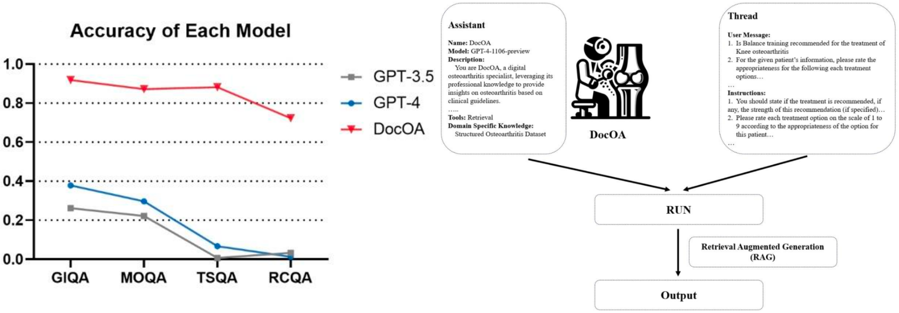
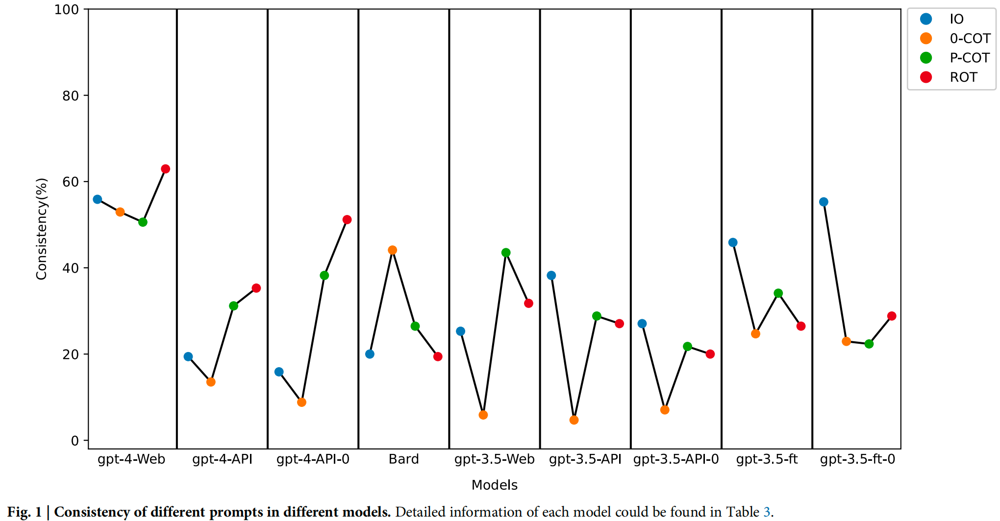

# Osteoarthritis-Benchmark


<!-- Insert the project banner here -->
<div align="center">
    <a href="https://"></a>
</div>

---

Updated on 2024.06.25


## Key Features

This is the first knowledge base for large language models focusing on osteoarthritis, containing evidence-based medical information on osteoarthritis that can be used for testing large language models and for retrieval-augmented generation.

Using this repository, the performance of different LLMs on osteoarthritis knowledge can be tested. This study first applies Retrieval-Augmented Generation (RAG) and prompting to establish DocOA, which can answer professional questions about osteoarthritis based on our constructed knowledge base.

The main branch includes all uploaded files, and we have divided these files into three branches. Below are the detailed descriptions of each branches: 


## Links

- [Paper 1](https://www.nature.com/articles/s41746-024-01029-4) and [Paper 2](https://pubmed.ncbi.nlm.nih.gov/38833165/).

<div align="center">
    <a href="https://"></a>
</div>

<div align="center">
    <a href="https://"></a>
</div>

## Get Started

### 1.Osteoarthritis dataset

`ltemQA.json`--GIQA;

`Real case QA.json`--RCQA;

`Treatment decision_QA_1213.json`--TSQA;

`treatment_based_QA.json`--MOQA;


Guideline-item QA (GIQA), which was developed based on specific items extracted from the clinical guidelines, evaluates the LLMs’ knowledge of these well-established standards. The GIQA comprised 337 items.

Real-case QA (RCQA) included treatment recommendations for 80 real-world patients. The RCQA, which comprised 80 items, evaluated LLMs’ capability in formulating treatment recommendations in a more complicated scenario in which individual information is provided, mirroring real-world clinical decision-making.

Treatment strategy QA (TSQA), which included treatment recommendations for different patient populations, provided treatment recommendations based on the patient’s age, clinical presentation, and other factors. The TSQA, which comprised 216 items, evaluated the capability of LLMs to derive treatment recommendations for specific patient types.

Management options QA (MOQA) included summarised recommendations for specific treatments from the included clinical guidelines.The MOQA, which comprised 145 items, evaluated LLMs’ knowledge of specific treatment options, as well as their ability to summarise medical evidence.

### 2.Codes and prompts to test and set up LLMs and DocOA

The file [`Prompt`](./Supply/Prompt): COT prompting and IO prompting mentioned in the manuscript.

The file [`Test code`](./Supply/Test%20code): To test the LLMs (GPT-3.5 and GPT 4.0) and DocOA to ensure responses are given without bugs.

[`Test code_GPT.ipynb`](./Supply/Test%20code/Test%20code_GPT.ipynb)--To test GPT-3.5 and GPT 4.0.

[`Test code_Retrieval.ipynb`](./Supply/Test%20code/Test%20code_Retrieval.ipynb)--To test DocOA.

[`Structure transfer.ipynb`](./Supply/Structure%20transfer.ipynb) — Transfer all the responses into JSON format.

### 3.Crude data from our initial tests

All [`outputs`](./Supply/Output) from the LLMs are copied and pasted into Excel files. Files whose names end in `retrieval` are outputs from DocOA.

Other information：

The file `Supply` includes the codes involved in the study, the prompts, and the model's output.


## 🙋‍♀️ Feedback and Contact

- [Email](geteff@wchscu.cn): geteff@wchscu.cn.


## 🛡️ License

This project is under the Apache-2.0 license. See [LICENSE](LICENSE) for details.

## 📝 Citation

If you find this repository useful, please consider citing this paper:
```
@article{wang2024prompt,
  title={Prompt engineering in consistency and reliability with the evidence-based guideline for LLMs},
  author={Wang, Li and Chen, Xi and Deng, XiangWen and Wen, Hao and You, MingKe and Liu, WeiZhi and Li, Qi and Li, Jian},
  journal={npj Digital Medicine},
  volume={7},
  number={1},
  pages={41},
  year={2024},
  publisher={Nature Publishing Group UK London}
}

@article{chen2024evaluating,
  title={Evaluating and Enhancing Large Language Models' Performance in Domain-specific Medicine: Explainable LLM with DocOA.},
  author={Chen, Xi and Wang, Li and You, M and Liu, W and Fu, Yu and Xu, Jie and Zhang, Shaiting and Chen, Gang and Li, Kang and Li, Jian},
  journal={Journal of Medical Internet Research},
  year={2024}
}
```

